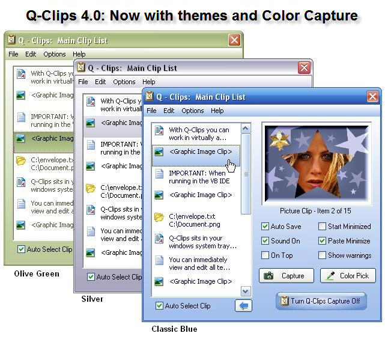



## Q\-Clips 4\.01: A Windows Clipboard Extender \(Update: 27 December 2007\)

### Description

Q-Clips 4.01 is a Windows Clipboard Extender that enhances and extends the Windows clipboard by remembering all items (text, graphics, color numbers and files) that are copied to the clipboard and storing them in a collection for later pasting... even after you shut off your computer. The program also features a built in Screen Capture tool, with magnify window, so you can capture any portion of the screen, the desktop, or active window, and send the contents to Q-Clips. While you work in your editor, word processor, graphic imaging program or virtually any Windows program, Q-Clips sits in your windows system tray... capturing all data that is copied to the Windows Clipboard. When you need to access those clips press the system wide HotKey... click on the desired clip and it will automatically paste into your program. Many features and options including saving Images as JPEG, multiple capture types, color themes and a color capture tool. For details on all features and their use view the Q-Clips Help Manual included in this upload and available from the Q-Clips Help Menu. (Ver. 4.01 Update: Added View Color Tool to view actual color of captured color number and more. Please see readme.txt file for all Update History Details.)
 
### More Info
 

             |
---                |---
**Submitted On**   |2007-12-26 21:43:46
**By**             |[Tom Moran](https://github.com/Planet-Source-Code/PSCIndex/blob/master/ByAuthor/tom-moran.md)
**Level**          |Advanced
**User Rating**    |5.0 (125 globes from 25 users)
**Compatibility**  |VB 6\.0
**Category**       |[Complete Applications](https://github.com/Planet-Source-Code/PSCIndex/blob/master/ByCategory/complete-applications__1-27.md)
**World**          |[Visual Basic](https://github.com/Planet-Source-Code/PSCIndex/blob/master/ByWorld/visual-basic.md)
**Archive File**   |[Q\-Clips\_4\_20952112272007\.zip](https://github.com/Planet-Source-Code/tom-moran-q-clips-4-01-a-windows-clipboard-extender-update-27-december-2007__1-69399/archive/master.zip)

### API Declarations

Several

